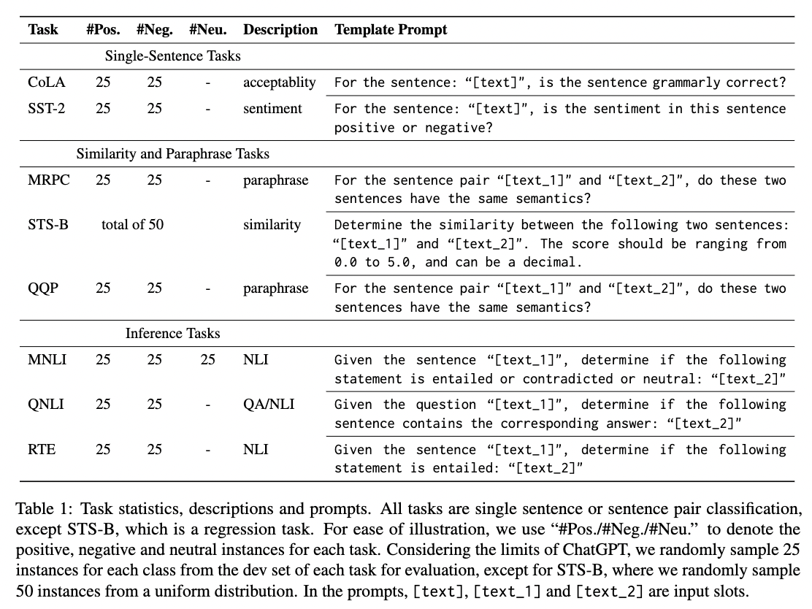

# ChatGPT-vs.-BERT
A Comparative  Study on ChatGPT and Fine-tuned BERT.


This repository releases the evaluated sets and the outputs predicted by BERT-style models and ChatGPT, for the replication of the study.

## Data and Predictions

For each task of the [GLUE](https://gluebenchmark.com/tasks) benchmark, we randomly sample 25 instances for each class from the dev set for evaluation, except for STS-B, where we randomly sample 50 instances from a uniform distribution. The data and its corresponding predictions can be obtained in "[./data](./data/)".

The task statistics and prompts are shown as follows:
<div align="center">
    
</div>

Additionally, we also provide the script for sampling and preprocessing the data in "[get_data.py](./get_data.py)". Taking the CoLA task as an example, you can resample k-instances by the following command:
```
python3 get_data.py --num 25 --task cola --model_pred BERT_pred_path --save_path save_data_path
```

## Results and Findings

- Overall, ChatGPT attains a comparable understanding ability compared with fine-tuned BERT-base, but still underperforms the other powerful BERT-style models, such as RoBERTa-large, by a clear margin.
```
Overall results on GLUE:


```
- ChatGPT falls short in handling paraphrase and similarity tasks. Specifically, ChatGPT performs poorly in negative paraphrase and neutral similarity samples, respectively.
```
Per-class accuracy on paraphrase task (MRPC):

Analysis on similarity task (STS-B):

```
- ChatGPT outperforms all BERT-style models on inference tasks by a large margin, indicating its impressive reasoning ability.
```
Per-class accuracy on inference tasks:

```
- Despite its good performance on inference tasks, ChatGPT may generate some contradictory or unreasonable responses, which would be its potential limitations.
```
Case study on inference tasks:


```


### Citation

```ruby
@article{zhong2023chat,
  title={Can ChatGPT Understand Too? A Comparative  Study on ChatGPT and Fine-tuned BERT},
  author={Zhong, Qihuang and Ding, Liang and Liu, Juhua and Du, Bo and Tao, Dacheng},
  journal={arXiv preprint},
  year={2023}
}
```
